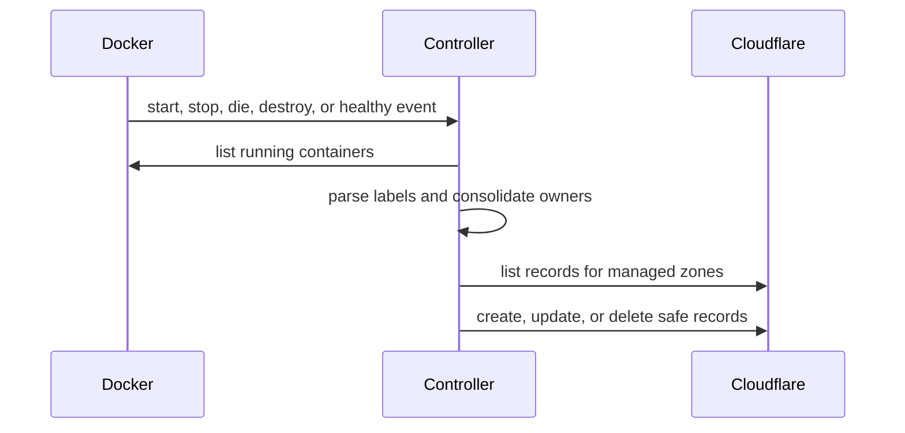

# Architecture

The controller uses a full running-container snapshot as the source of truth. Docker events provide low-latency triggers, while periodic reconciliation repairs missed events and external drift.



## Boundaries

- `labels` converts one container's labels into normalized desired routes.
- `ownership` consolidates identical claims and quarantines conflicting claims.
- `cloudflare_api` owns authentication, API envelopes, pagination, and retries.
- `reconciler` is the only module that decides whether DNS may be mutated.
- `docker_watcher` discovers running containers and turns lifecycle events into reconciliation triggers.
- `main` serializes reconciliation, schedules periodic repair, and manages shutdown and health.

## Ownership

Runtime ownership uses container IDs. Cloudflare comments provide the durable management boundary across restarts:

```text
managed-by=cfroute-controller;version=1;delete-on-stop=true
```

The controller never mutates an unmarked record. A marked orphan is deleted only when its marker has `delete-on-stop=true` and its zone is in the managed-zone scope.

## Consistency

Operations are idempotent and eventually consistent. A partial batch failure does not roll back successful changes. Each event or periodic pass recomputes the complete desired snapshot and retries only the remaining drift.